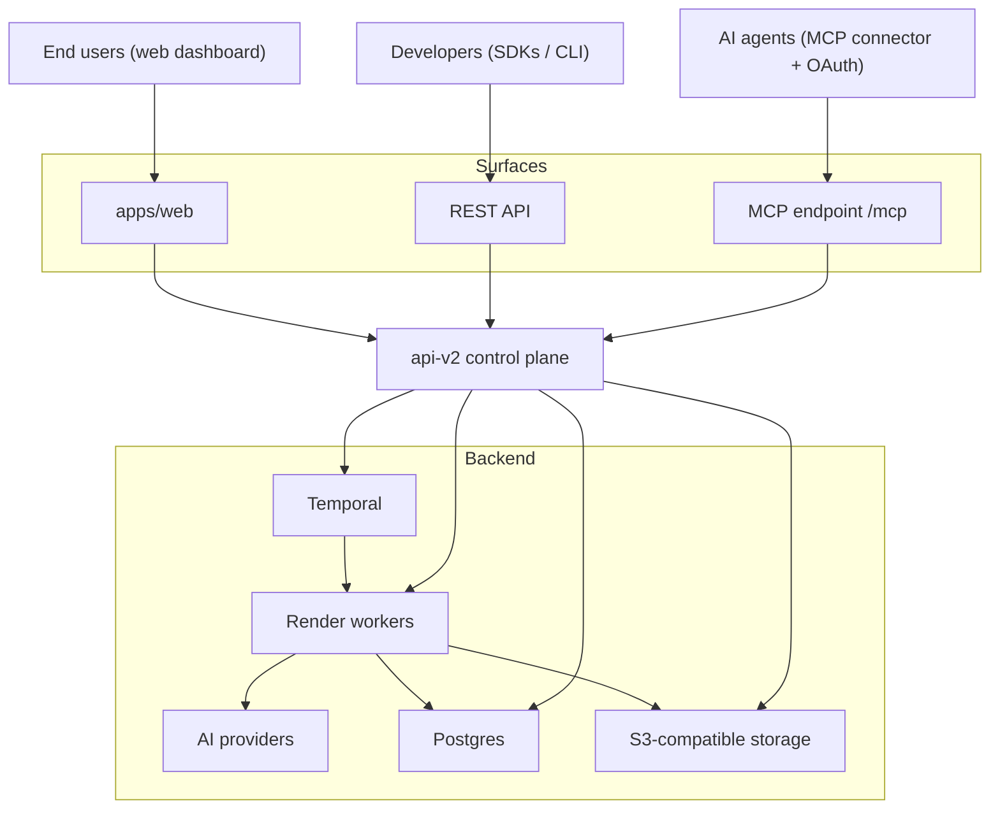
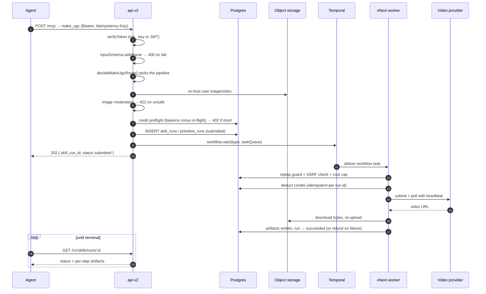
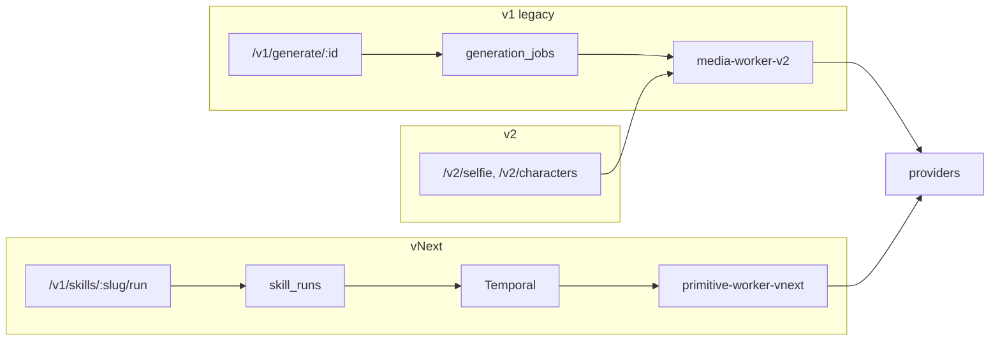
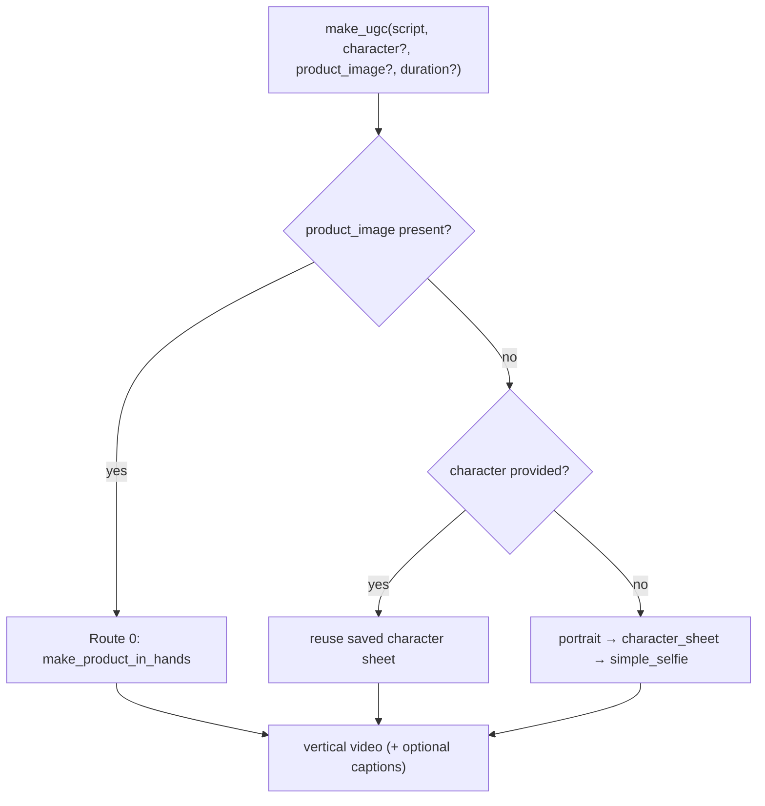
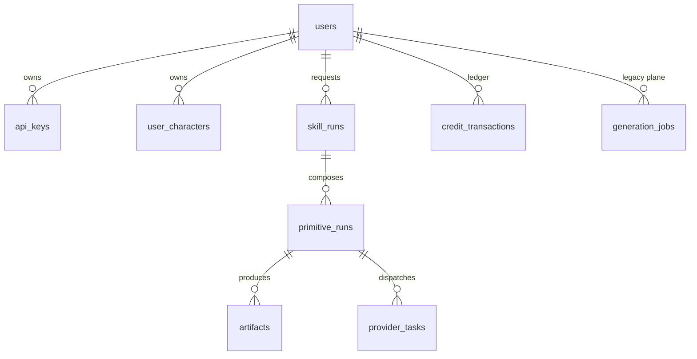
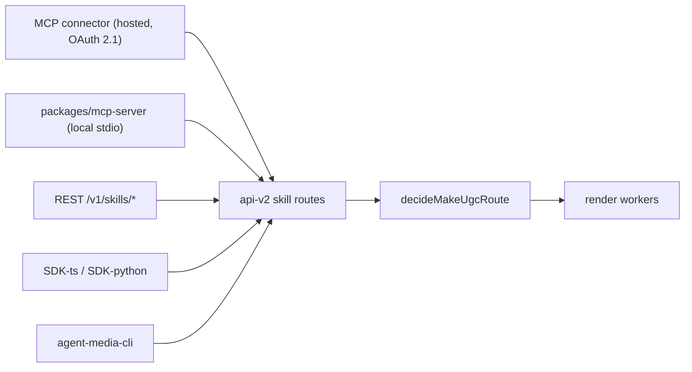

# Architecture

How agent-media is put together, and why. This is the map for contributors and
self-hosters.

## System overview & design philosophy

agent-media is an agent-native platform for generating user-generated-content (UGC) video. The caller describes a video in a single sentence — a script, and optionally a person description, a photo, or a saved character — and a server-orchestrated pipeline returns a finished, captioned vertical video. The surface is reachable four ways: a REST API, a CLI published to npm as `agent-media-cli`, MCP (a local stdio server plus a hosted HTTP connector with OAuth), and a web dashboard.

The north star is to be the best agent-native UGC video surface: one tool, `make_ugc`, script in and vertical video out, with engine selection made by the server, never by the caller. Engine choice is not hidden, though: the owner decided (#26) that the Shot Plan shows each shot's video model and its fallback before Confirm, and the result shows the model each shot rendered on. Which model a shot kind renders on is Preset data (`shotKinds[kind].video`), priced from that data and never branched on in code; the caller can see it but never change it. A generation is a single durable Temporal workflow with per-step progress and an automatic credit refund on failure — not an agent hand-assembling clips from primitives. That "one durable call, not a recipe" property is the core differentiator, and the price is always quoted before spend.

Every design decision descends from a single principle called **The Spine**: *the server always does the craft; the human or agent only chooses WHAT to make, never HOW it is made.* Two authorities never leave the server. **Routing authority** — which pipeline runs for a request — is decided by the pure function `decideMakeUgcRoute` (`services/api-v2/src/skills/make-ugc-router.ts`), never by a public decision tree an agent reads and follows. **Quality authority** — the realism prompt wrapper, product staging, character consistency across takes, voice pacing, and captions — lives in worker activity code so it applies on every path, whether template, direct primitive, or chained.

The product is organized as three tiers over one quality floor. **Tier 1 — Templates** (`make_ugc`, `make_podcast`, `make_product_in_hands`) are the opinionated, server-locked default and the hero surface. **Tier 2 — Primitives** (`make_portrait`, `make_character_sheet`, `make_simple_selfie`, `make_subtitles`, `make_lip_sync`, `make_wireframe`) expose the underlying steps as composable units, hidden from listing but runnable by slug. **Tier 3 — Raw / expert access** is deliberately narrow.

## Services & responsibilities

The monorepo is a pnpm + turbo workspace.

| Service | Runtime | Responsibility |
|---|---|---|
| `services/api-v2` | TypeScript ESM, Node 20, Express 4 | Control plane: auth → validate → route → re-host + moderate → credit preflight → dispatch. Owns the OpenAPI spec, the hosted MCP endpoint (`/mcp`), and the OAuth proxy |
| `services/primitive-worker-vnext` | TypeScript, Temporal worker | Modern render plane. Executes vNext workflows and primitive activities; durable execution, idempotency, SSRF pinning, cost caps, compensating refunds |
| `services/media-worker-v2` | JavaScript, Express + FIFO queue | Legacy render plane. Calls providers and assembles with ffmpeg |
| `services/brand-extractor` | JS, Playwright + vision call | Extracts brand palette/context from a URL |
| `apps/web` | Next.js 15, React 19, Tailwind v4 | Dashboard app (auth, create, gallery, jobs, settings). Marketing pages are not part of this distribution |
| `apps/cli` | TypeScript | `agent-media-cli` on npm |
| `supabase/functions` | Deno edge functions | Checkout, webhooks, presigned URLs, job status, persona/actor CRUD, usage stats |
| `packages/mcp-server` | TypeScript | Local stdio MCP server (companion to the hosted `/mcp` connector) |
| `packages/sdk-ts`, `packages/sdk-python` | TS / Python | SDKs against api-v2 |
| `packages/schema`, `packages/types`, `packages/ui` | TS | Shared schema, types, UI components |
| `packages/shot-prompts` | TS, private | Server-only Shot Prompt wording (shot fields, Guardrails per stage, the guardrail check), shared by api-v2 and primitive-worker-vnext |

Every backend service ships its own `Dockerfile`, so they can be deployed independently, to different hosts, and scaled separately.

## System context



## Request path



## The three generation planes

Three generation stacks coexist. They share a product surface but not the same tables or worker.

- **v1 (legacy)** — `POST /v1/generate/:generatorId`, state in `generation_jobs`, dispatched to media-worker-v2 via queue or direct HTTP.
- **v2** — `/v2/*` routes (selfie, characters, subtitle), an isolated additive plane.
- **vNext (modern)** — Temporal-orchestrated composed workflows on `primitive-worker-vnext`, state in `skill_runs` / `primitive_runs` / `artifacts`. This is where new work goes.



## make_ugc — the agent facade

`make_ugc` is the single agent-facing entry point. A pure function decides the route; the same function runs at quote time, so the price you are quoted is the price you are charged.



## Data model (core tables)



Row Level Security is enabled on user-owned tables: every read is scoped to the
calling user. The `service_role` key bypasses RLS and is used only server-side.
Money-mutating RPCs are `SECURITY DEFINER` and restricted to `service_role`.

## Credits & spend safety

Credits are **duration-based and model-independent** (5s / 10s / 15s tiers), so
switching the underlying model never changes what a caller pays. Four properties
protect spend:

1. **Quote before spend** — `POST /v1/skills/:slug/quote` returns the exact price.
2. **In-flight reservation** — concurrent runs cannot overdraw a balance.
3. **Hard 402 gate** — dispatch is blocked before any provider call, not advised after.
4. **Idempotency** — `Idempotency-Key` replay returns the original run instead of double-charging. The key is bound to the request body (a sha256 fingerprint of the validated input, `request_fingerprint`): the same key with a different body is refused with 409 `idempotency_key_reused`.

Failures trigger a compensating refund inside the workflow, so a failed render
does not silently consume credits.

## Tool surfaces

All four surfaces funnel into the same api-v2 skill routes — there is one
implementation of the craft, not one per client.



The agent-facing surface is deliberately curated. The hosted connector lists
exactly eight tools: the six `agentFacing` skills — `make_ugc`, `make_podcast`,
`make_subtitles`, `make_product_hero` (renders an approved Product Hero draft
into a Short; see ADR 0001), `make_reaction` (renders an approved draft as a
Reaction Short: a saved character reacting silently, intercut with the
product), `make_hands_on` (renders an approved draft as a Hands-on Short:
first-person hands with the product, ending on a product shot) — plus
`create_character` and `list_characters`. The set of `agentFacing` skills is
pinned by `agent-facing-surface.test.ts`. Fewer, well-described tools beat a
large catalog for agent context.

## Self-hosting: swapping the managed pieces

The hosted product runs on Supabase, Temporal Cloud, Cloudflare R2 and Railway,
but nothing in the code requires those vendors — each is reached over a standard
protocol, so `docker-compose.yml` substitutes open equivalents:

| Hosted uses | Self-host substitute | Why it swaps cleanly |
|---|---|---|
| Supabase Postgres | `postgres:15` | Plain Postgres + the SQL in `supabase/migrations` |
| Temporal Cloud | `temporalio/auto-setup` | Same gRPC API; point `TEMPORAL_ADDRESS` at it |
| Cloudflare R2 | MinIO | R2 is S3-compatible; MinIO speaks the same API |
| Railway | any container host | Every service ships a Dockerfile |
| Vercel | any Node host | `apps/web` is a standard Next.js app |

Configuration is injected purely at runtime — no secrets baked into images, and
nothing sensitive inlined into the client bundle.

### Billing is optional

The credits/billing layer keys off whether Stripe is configured. With no
`STRIPE_SECRET_KEY`, billing is off: no credit preflight, no deduction.
Self-hosters bring their own provider keys and pay the upstream providers
directly.

## Provider abstraction

Video generation goes through an **adapter registry** — pipelines never branch
on the vendor. Adding a backend is a new file plus one registry line.

```
services/media-worker-v2/src/providers/
  index.js      registry: getVideoProvider(), normalizeRequest(), generateVideo()
  evolink.js    EvoLink / Seedance 2.0 (default)
  byteplus.js   BytePlus ModelArk / Dreamina Seedance
```

Every adapter implements one interface:

```js
{
  name: 'evolink',
  requiredEnv: ['EVOLINK_API_KEY'],
  isConfigured(): boolean,
  generateVideo(request, options): Promise<string>   // -> video URL
}
```

`request` is **provider-neutral** — `{ prompt, imageUrls, durationSeconds,
aspectRatio, generateAudio, quality }` — and each adapter translates it into its
vendor's dialect, so quirks stay contained (BytePlus calls the aspect ratio
`ratio`; EvoLink takes a `quality` tier). Duration clamping happens once in
`normalizeRequest()` rather than in every pipeline.

Selection is by `VIDEO_PROVIDER` (default `evolink`). An unknown name or missing
credentials fails fast with a message naming the required env vars, instead of a
generic 500 mid-render. Pin models with `EVOLINK_SEEDANCE_MODEL`,
`BYTEPLUS_SEEDANCE_MODEL`, `GPT_IMAGE_MODEL`.

**To add a provider:** create `providers/<name>.js` exporting an adapter, import
it in `providers/index.js`, add it to `PROVIDERS`. No pipeline changes.

The vNext Preset render does the same per shot kind: a Preset's shot kind
names its video model (and a fallback) as data
(`shotKinds.reaction.video = { model: 'modelark-seedance-2.0-mini', fallback: ['kling-o3-pro', 'veo-3.1'] }`,
`packages/schema/src/video-models.ts`; absent = Seedance via EvoLink; a
fallback is one model or a chain tried in order), and
`services/primitive-worker-vnext/src/video-models/` maps each model id to its
client and request builder (fal's queue API for Kling O3 Pro and Veo 3.1,
`FAL_KEY`; BytePlus ModelArk for Seedance 2.0 Mini, `ARK_API_KEY`).
Person shots render on ModelArk Seedance 2.0 Mini, with Kling and Veo as the
fallback chain — see
[ADR 0003](docs/adr/0003-person-shots-on-modelark-seedance.md). ModelArk
refuses a photoreal face unless it is the same account's own Seedream output
passed on untouched, so a shot on ModelArk never gets a re-hosted character
image: it sends the product reference alone and describes the person in words
(the character's gender and saved description, plus the Modesty Default); the
face goes only to a fallback that takes it (`modelTakesPersonImage`), and each
attempt gets its own model's prompt. ModelArk's refusals
(`InputImageSensitiveContentDetected.PrivacyInformation` at submit, a
moderation verdict on a failed task) map to the one content-policy refusal, so
the fallback runs. A shot is charged its model chain's price whichever model ran, so
the quote is the charge with or without the fallback; its provider cost is
budgeted worst case (the failed primary attempt plus the fallback). What a
failure allows — a Temporal retry, the fallback — is one map,
`services/primitive-worker-vnext/src/failure-policy.ts`: a fal job is never
resubmitted by a retry (the fallback is its retry), and a missing provider key
fails fast.

Every clip and starting-frame prompt is a **Shot Prompt** (CONTEXT.md, #26,
#28): the shot's structured fields (framing, scene, blocking, environment
interaction, performance, action, energy, camera move, lens feel, lighting),
composed in a fixed order, plus its locked **Guardrails** for that stage —
image (the starting frame) or video (the clip): references, nobody speaks and
one simple hand action (video), the Modesty Default, no people on a product
shot, no text, audio off (video). Shots have stable ids: the shot's role from the
Preset data (`reaction`, `product-closer`; `reaction-2` only when the order
cycles), never the position or the kind's ordinal. The wording lives
in `packages/shot-prompts` (`@agentmedia/shot-prompts`), a *private* workspace
package — never published, unlike `@agentmedia/schema`, because the prompt
craft is server-side — shared by api-v2 (which composes the **Shot Plan** for
`POST /v1/skills/{slug}/shot-plan` and checks a quote's or run's
`shot_edits`) and the worker (which re-checks the edits and always adds its
own Guardrails). Every hands and person stage also carries the realism
Guardrail (a raw phone look, flat everyday light, a sharp background, matte
skin with pores, no beauty filter; ADR 0003), never a product shot. Fields and
Guardrails name images with provider-neutral tokens; each video model adapter
puts in its own reference syntax (EvoLink `@image1` / `@image2`, fal "the
first / second reference image", ModelArk "image 1" / "image 2"). The prompt
as sent is stored on its clip row and on the Short (`final_output.shots`).

Images go through `gpt-image-2` (`OPENAI_API_KEY`) and prompt craft through
Anthropic (`ANTHROPIC_API_KEY`). The legacy b-roll and talking-head lanes still
read `BROLL_PROVIDER` / `TALKING_HEAD_PROVIDER` directly and have not yet been
migrated onto the registry — see [CONTRIBUTING.md](CONTRIBUTING.md).

## Security model

- **RLS everywhere** on user-owned tables; reads are scoped to the caller.
- **`service_role` is root** — bypasses RLS, server-side only, never in a client bundle or git.
- **API keys are hashed** (SHA-256) in `api_keys`; revoke by setting `is_active = false`.
- **Rate limits are per-user post-auth**, keyed on the authenticated user id; IP-keyed limiting is used only as a pre-auth flood guard.
- **SSRF protection** on media ingest: user-supplied URLs are re-hosted through a checked fetch path.
- **Image moderation** runs before spend and fails open by default (an upstream outage should not block every upload); invert with `IMAGE_MODERATION_FAILCLOSED=1`.

See [SECURITY.md](SECURITY.md) for reporting vulnerabilities.
